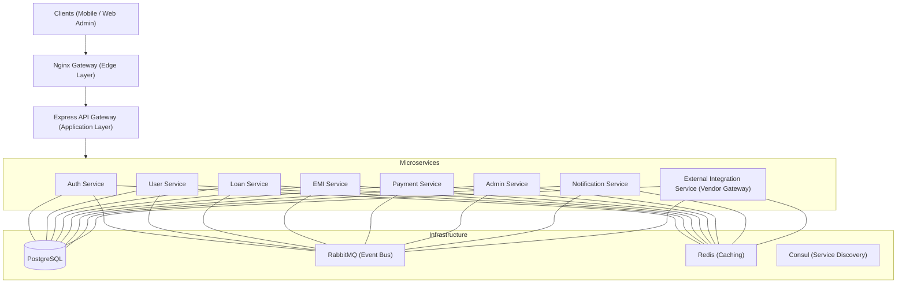

# 🏦 Loan Fintech Platform — Express Microservices Architecture

Production-grade loan management platform built with a high-performance, resilient microservices architecture. This platform handles the entire loan lifecycle, from user onboarding and KYC to loan adjudication, EMI scheduling, and automated payments.

---

## 🏗 System Architecture

The project follows a **Layered Microservices Architecture** to ensure separation of concerns, scalability, and security.

### High-Level Design (HLD)

### Request Flow
1.  **Edge Layer (Nginx)**: Handles SSL termination, load balancing, and basic security filtering.
2.  **API Gateway**: Acts as the single entry point. It manages JWT authentication, request validation, and routes requests to downstream services.
3.  **Microservices**: Domain-specific logic implementation.
4.  **Vendor Gateway (External Service)**: All 3rd party API calls (Cashfree, KYC providers) are abstracted here to maintain vendor independence.

---

## 🔗 Communication Strategy

The platform uses a hybrid communication model to balance performance and reliability:

### 1. Synchronous (gRPC)
Used for real-time reads or critical validations where an immediate response is required.
*   **Example**: `Loan Service` calling `User Service` to verify KYC status during application.
*   **Protocol**: HTTP/2 with Protocol Buffers (Protobuf) for high performance and type safety.

### 2. Asynchronous (RabbitMQ)
Used for state changes and side effects to ensure loose coupling and system resilience.
*   **Example**: `Loan Service` publishes `loan.approved` event → `EMI Service` consumes it to generate schedules → `Notification Service` sends an SMS.
*   **Reliability**: Persistent queues and manual acknowledgments are used to prevent data loss.

---

## 🧩 Microservices Breakdown

| Service | Schema | Description | Key Endpoints |
| :--- | :--- | :--- | :--- |
| **Auth** | `auth_schema` | Identity & RBAC | `POST /v1/auth/login`, `/register` |
| **User** | `user_schema` | Profiles & KYC | `GET /v1/users/profile`, `POST /kyc` |
| **Loan** | `loan_schema` | Loan Lifecycle | `POST /v1/loans/apply`, `GET /status` |
| **EMI** | `emi_schema` | Repayment Engine | `GET /v1/emis/schedule/:loanId` |
| **Payment**| `payment_schema` | Transaction Manager | `POST /v1/payments/pay`, `/webhook` |
| **External**| `external_schema`| Vendor Gateway | gRPC only (Internal) |
| **Admin** | `admin_schema` | Control Plane | `GET /v1/admin/dashboard` |
| **Notification**| `notification_schema`| Comms Engine | Event-driven (Internal) |

---

## 🗄 Database Architecture

A **Shared Instance, Schema-per-Service** strategy is implemented:
*   **Isolation**: No cross-service joins or foreign keys. Services only access their own schema.
*   **Consistency**: Distributed transactions are handled via the **Saga Pattern** (using RabbitMQ events).
*   **Resilience**: `connectWithRetry()` logic ensures services wait for the DB to become ready during startup.

---

## 🛡 Handling Failures & Resilience

1.  **Retry Pattern**: Automatic retries with exponential backoff for DB and RabbitMQ connections.
2.  **Circuit Breaker**: Implemented for external vendor calls to prevent cascading failures.
3.  **Idempotency**: All payment and EMI operations are idempotent to handle duplicate event processing safely.
4.  **Graceful Degradation**: If the Notification service is down, core loan processing continues, and notifications are queued.

---

## 📊 Observability & Monitoring

*   **Consul**: Service registration and health monitoring.
*   **Prometheus**: Scrapes `/metrics` endpoints from all services for real-time performance data.
*   **Grafana**: Pre-configured dashboards for monitoring API latency, error rates, and system resource usage.
*   **Winston Logger**: Centralized structured logging for easier debugging.

---

## 🚀 Getting Started

To get the platform up and running on your local machine, refer to:
👉 [**Getting Started Guide (Local Setup)**](./GETTING_STARTED.md)

---

## 📚 Technical Stack

*   **Language**: TypeScript / Node.js
*   **Framework**: Express.js
*   **Communication**: gRPC, RabbitMQ
*   **Database**: PostgreSQL 15, Redis
*   **Infrastructure**: Docker, Nginx, Consul
*   **Monitoring**: Prometheus, Grafana
