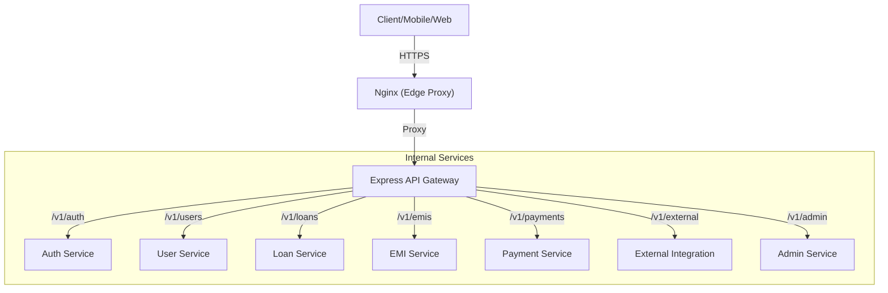

# API Gateway Service

The **API Gateway** is the single entry point for all client requests in the Fintech Platform. It serves as an intelligent reverse proxy, routing requests to appropriate microservices while handling cross-cutting concerns.

## What is an API Gateway?

In a microservices architecture, an API Gateway acts as a "traffic cop." Instead of clients communicating directly with dozens of individual services, they send all requests to the Gateway. The Gateway then:
- Validates the request.
- Routes it to the correct internal service.
- Aggregates responses if necessary.
- Handles security, logging, and metrics.

## Architecture

We use a **Layered Gateway Architecture** for maximum performance and flexibility:

### Layer 1: Nginx (Edge Gateway)
Nginx acts as the high-performance entry point. It handles:
- SSL/TLS Termination.
- Static content caching.
- Load balancing across multiple API Gateway instances.
- Basic rate limiting.

### Layer 2: Express Gateway (Application Gateway)
A custom Node.js/Express service that provides programmatic control over:
- Dynamic Routing.
- Authentication & Authorization checks.
- Request/Response transformation.
- Custom Business Logic (e.g., aggregation).

## Request Flow

1. **Client Initiation**: A client sends a request to `https://api.fintech.com/v1/loans`.
2. **Nginx Reception**: Nginx receives the request, strips SSL, and forwards it to the `api-gateway` service.
3. **Gateway Processing**:
    - **Metrics**: Captures request timing and counts.
    - **Logging**: Records the incoming request via Morgan.
    - **Routing**: Matches the path `/v1/loans` to the `LOAN_SERVICE_URL`.
    - **Proxying**: Using `http-proxy-middleware`, it rewrites the path (e.g., removals of `/v1/loans`) and forwards the request to the internal microservice.
4. **Service Execution**: The internal service (e.g., Loan Service) processes the business logic.
5. **Response Return**: The service returns the response through the Gateway back to Nginx and finally to the client.

## Service Routing Table

| Route | Target Service | Purpose |
|-------|----------------|---------|
| `/v1/auth` | Auth Service | Identity, Login, JWT Management |
| `/v1/users` | User Service | Profile, KYC, User Management |
| `/v1/loans` | Loan Service | Applications, Approval, Lifecycle |
| `/v1/emis` | EMI Service | Repayment Schedules, Interest Calc |
| `/v1/payments` | Payment Service | Transactions, Payouts, Reconciliations |
| `/v1/external`| External Service| Third-party Vendor Integrations |
| `/v1/admin` | Admin Service | Back-office management |

## Future Extensibility

To add a new service to the platform:
1. Define the service URL in the `.env` file.
2. Add a new `app.use()` route in `src/index.ts` using `createProxyMiddleware`.
3. Update the routing table in this document.

> [!TIP]
> Always ensure new routes are versioned (e.g., `/v1/`) to prevent breaking changes for clients as the API evolves.
