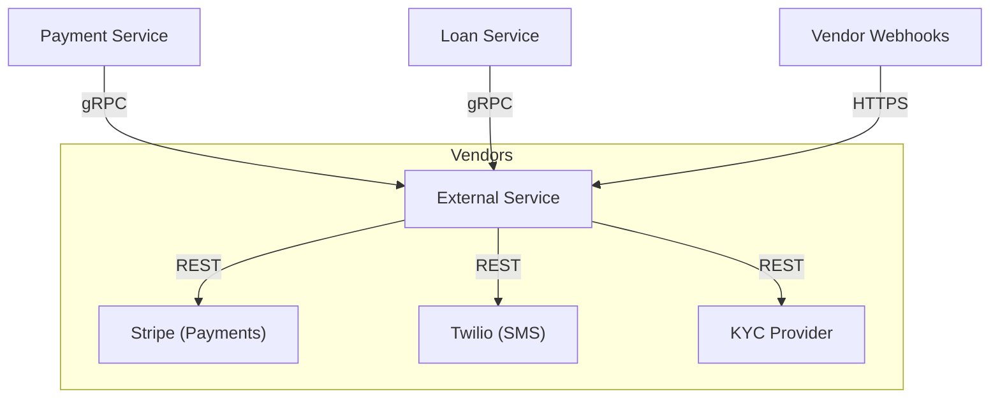

# External Integration Service (Vendor Gateway)

The **External Integration Service** acts as a centralized gateway for all third-party API interactions. It provides a unified interface for internal services while abstracting away vendor-specific implementations and complexities.

## Role

In our microservices architecture, this service functions as an **Anti-Corruption Layer (ACL)**. It ensures that vendor-specific data models and API quirks do not "pollute" our internal domain logic.

## Key Features

- **Vendor Abstraction**: Switch between vendors (e.g., Stripe to PayPal, Twilio to SendGrid) with minimal impact on other services.
- **Protocol Bridging**: Exposes high-performance **gRPC** endpoints for internal services while communicating over **REST/HTTPS** with external vendors.
- **Resilience**: Implements retries and circuit breaking for unreliable third-party APIs.
- **Uniform Auditing**: Centralized logging and auditing for all outbound requests.

## Architecture

## Internal Interfaces (gRPC)

The service exposes the following main methods (defined in `protos/external.proto`):
- `ProcessPayment`: Routes a payment request to the active provider.
- `VerifyIdentity`: Performs KYC/Identity verification.
- `SendNotification`: Forwards messages to communication vendors.

## Webhooks

The service hosts a standard `/webhooks/:provider` endpoint to receive asynchronous updates from vendors, which it then translates into internal RabbitMQ events.

> [!CAUTION]
> API Keys and Secrets must **NEVER** be committed to the repository. They are managed via environment variables and production secret managers.
