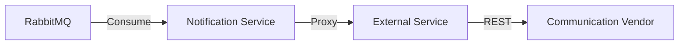

# Notification Service

The **Notification Service** is the asynchronous communication engine of the platform. It is responsible for delivering emails, SMS, and push notifications to users based on system events.

## Role

This service is purely **Event-Driven**. It does not expose public REST APIs for sending messages; instead, it "listens" to the platform's heartbeat and reacts accordingly.

## Key Features

- **High Decoupling**: Services like Loan or Payment do not need to know how to send messages; they only need to announce that "something happened."
- **Reliability**: Uses RabbitMQ to ensure that even if the notification vendor is temporarily down, messages are queued and retried.
- **Template Management**: Standardizes the look and feel of all user communications.

## Event Subscriptions

The service listens for the following RabbitMQ events:

| Event | Action taken |
|-------|--------------|
| `loan.created` | Sends "Loan Application Received" welcome message. |
| `loan.approved` | Sends "Congratulations! Loan Approved" notification. |
| `payment.completed`| Sends "Payment Confirmation" receipt. |

## Architecture

## How it works

1. An internal service publishes an event to the RabbitMQ exchange.
2. The Notification Service's **Listeners** pick up the message.
3. The message is validated and a corresponding template is selected.
4. The service calls the **External Integration Service** (via gRPC) to actually deliver the message through a vendor.
5. The delivery status is logged in the `notifications` table for auditing.

> [!NOTE]
> The Notification Service maintains its own local database to track message delivery history and status for audit trails.
