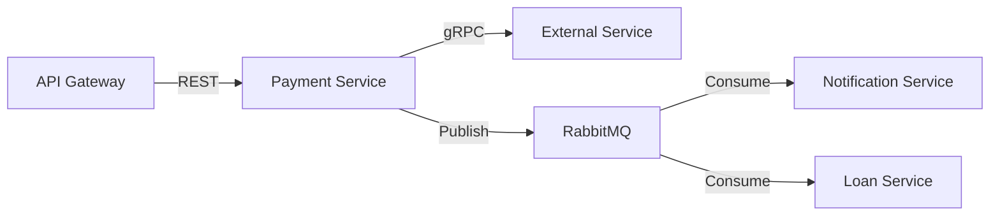

# Payment Service

The **Payment Service** is responsible for orchestrating all financial transactions within the Fintech Platform. It ensures data integrity, idempotency, and reliable communication with external payment providers.

## Responsibilities

- **Transaction Management**: Creating and updating transaction records in the database.
- **Idempotency**: Ensuring that duplicate payment requests do not result in multiple charges.
- **Event Orchestration**: Publishing `PaymentCompleted` or `PaymentFailed` events to RabbitMQ for other services (like Loan or Notification) to consume.
- **Status Tracking**: Managing the lifecycle of a payment (PENDING, SUCCESS, FAILED).

## Architecture & Integration

The Payment Service acts as a coordinator between the core business logic (Loans) and the external financial world.

## Core Flow

1. **Request**: Receives a payment initiation request from the API Gateway.
2. **Persistence**: Creates a transaction record with status `PENDING`.
3. **Execution**: Calls the **External Integration Service** via gRPC to interact with payment vendors (e.g., Stripe, Bank APIs).
4. **Completion**: Upon receiving vendor confirmation, updates the transaction status.
5. **Notification**: Publishes a `payment.completed` message to the message broker.

## Environment Variables

- `DB_URL`: PostgreSQL connection string.
- `RABBITMQ_URL`: Connection string for the message broker.
- `EXTERNAL_SERVICE_URL`: gRPC endpoint for the External Integration Service.

> [!IMPORTANT]
> This service uses **database-level locking** for critical transaction updates to prevent race conditions during concurrent payment processing.
